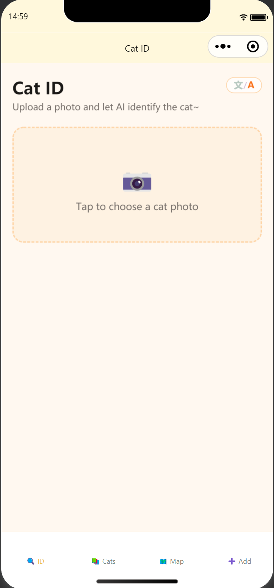
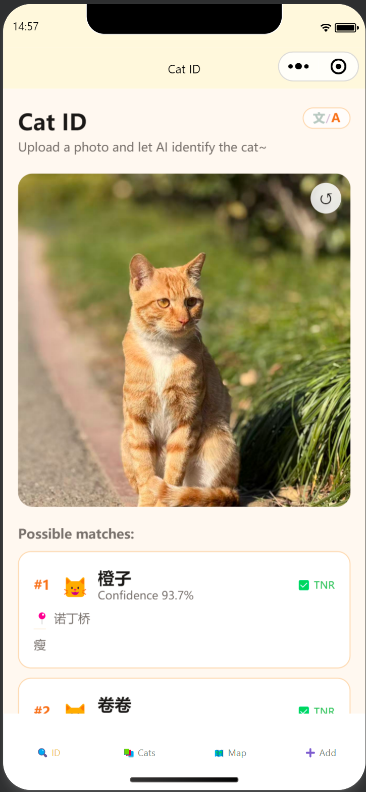
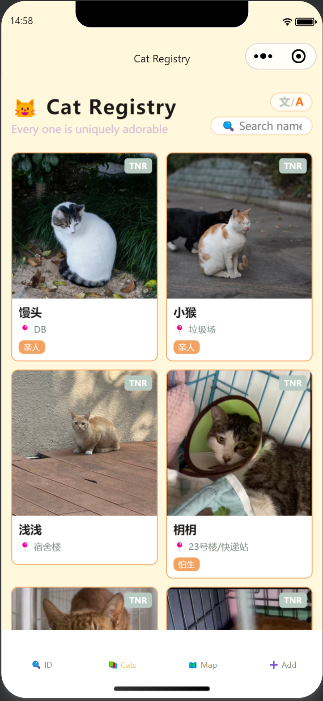
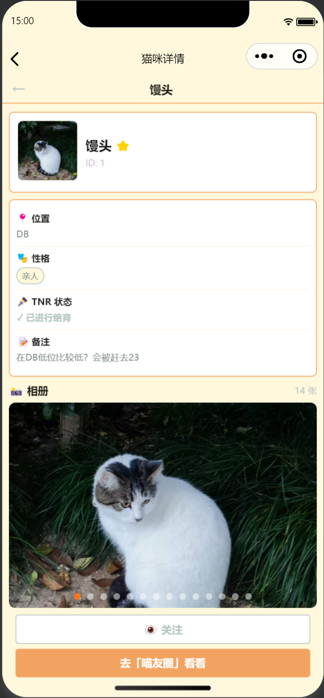
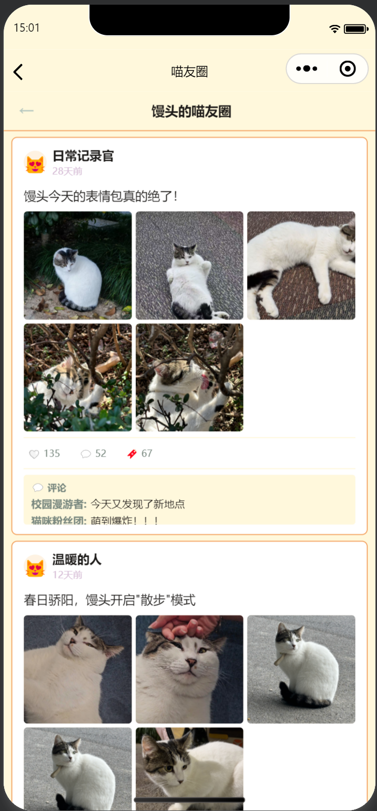

# 🐾 喵友圈圈 (UNNC CatRec)

[English Version](README_en.md) | **中文版**

> 一个专门为宁波诺丁汉大学（UNNC）校园流浪猫打造的 AI 识别与图鉴小程序。

## 📖 项目简介

UNNC CatRec（喵友圈圈）是一个集成了人工智能视觉模型的校园猫咪识别与档案记录平台。无论是偶遇了不知名的校园猫咪，还是想随时“云吸猫”、查看猫咪们的日常热点地图，“喵友圈圈”都能为你提供最贴心、最治愈的体验。

## 📝 2026.4.1 更新与合并阅读入口

- 今日中文更新日志（Zoe）：[UPDATE_LOG_2026-04-01_ZOE.md](UPDATE_LOG_2026-04-01_ZOE.md)
- 当前上下文与项目状态：`CLAUDE_CONTEXT.md`
- 后端数据流程说明：`backend/DATA_PIPELINE.md`

---

## 🌟 核心功能

### 🔍 AI 猫咪识别 (Identify)
基于深度学习视觉模型（支持 DINO-v2 特征嵌入算法），一键上传猫咪照片，系统即可在几十毫秒内智能比对图库，高精度告诉你这是哪位校园“大明星”。

| 📸 上传相片 | ✨ 识别结果 |
| :---: | :---: |
|  |  |

### 📚 校园猫咪名册 (Cat Registry)
完整收录 UNNC 校园内的猫咪档案，包含基础信息（名字、常出没地点、性格标签）、健康情况（绝育 TNR 状态标记）。支持双语（中/英）自由切换。

| 🐱 猫咪名册 | 🏷️ 猫咪详情 |
| :---: | :---: |
|  |  |

### 📸 喵友圈 (Cat Moments)
内置精美的类“微信朋友圈”风格猫片画廊。利用随机排版算法引擎，将静态猫图秒变为生动的专属社交动态时间线，配合动态生成的热评与点赞，让你沉浸式看猫。

| 🐾 专属动态 |
| :---: |
|  |

### 🗺️ 校园地图与热点 (Campus Map)
基于校园物理坐标系映射的动态活动热点地图，直观显示图书馆、17/18号楼、DB楼等地点的猫主子驻扎密度。

### ➕ 加入新成员 (Add New Cat)
提供表单页用于报告校园新发现的猫咪成员。关键接口由管理员口令（如 `UNNC2026`）严格把控，维护图鉴的整洁与安全。

---

## 💻 技术栈

- **前端 (Frontend)**: `Vue 3` + `Vite` + `UniApp`。完美兼容 H5 静态网页与微信小程序多端编译。
- **后端 (Backend)**: `FastAPI` (Python) + `SQLite`。轻量级本地数据持久化层，快速执行地理映射与属性存储。
- **AI/图像模型**: 基于 `PyTorch`。由图像文件解码提取高维向量 Tensor Embeddings，运算余弦相似度矩阵来给出结果预测。

---

## 🚀 快速启动（本地开发）

### 1. 启动后端服务器
```bash
cd backend
pip install -r requirements.txt
uvicorn main:app --reload
```

### 2. 启动前端页面
```bash
cd frontend
npm install
npm run dev:h5      # 浏览器预览 (Web H5)
npm run dev:mp-weixin # 微信开发者小程序端
```

---

## 🤝 感谢与支持

本项目致力于连接科技与自然环境的关爱。如果您在宁诺校园偶遇新猫片，或对代码有改进建议 (PR / Issues)，我们表示最真诚的感谢！

**Let's give every campus cat a name!** 🐾
